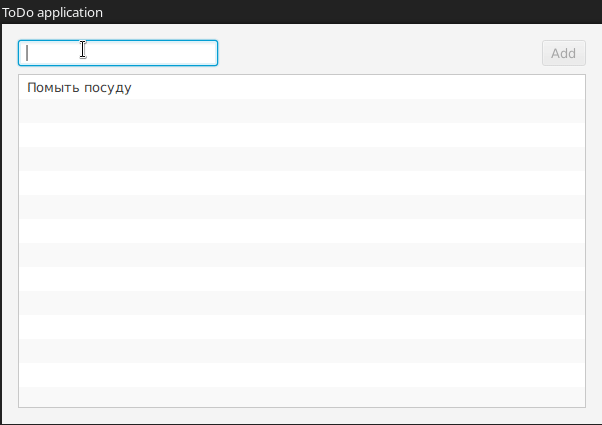

= javafx-todoapp

`javafx-todoapp` - простое демо-приложение на JavaFX.
Представляет собой список задач (`Todo`).

== Демо в `gif`

== Запуск приложения в Intellij IDEA

. File
. New
. Project from Version Control
. Вставить `git@github.com:cac03/javafx-todo.git`
. Clone
. После того, как загрузится проект
.. `Ctrl` + `E`
.. Maven
.. `javafx-todoapp` -> Lifecycle -> `package`
. Открыть класс `Main` (не **`TodoApplication`**)
. Зеленый треугольник -> Run

== Сборка `jar`

. Открыть проект в Intellij IDEA
. `Ctrl` + `E`, Maven
. `javafx-todoapp` -> Lifecycle -> `package`

После этого `javafx-todoapp-1.0-SNAPSHOT.jar` появится в директории `target`.

Его можно запустить следующей командой:

[source,bash]
----
$ java -jar target/javafx-todoapp-1.0-SNAPSHOT.jar
----